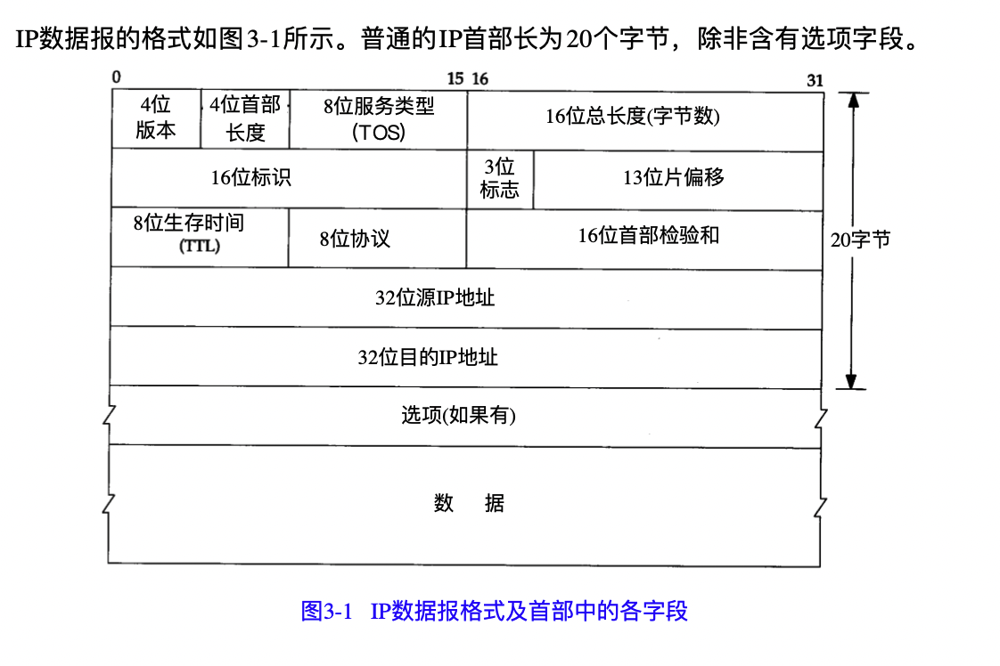

# TCP/IP详解

## IP：网际协议层

IP提供不可靠、无连接的数据报传送服务；

不可靠的意思是它不能保证 IP数据报能成功地到达目的地。

无连接这个术语的意思是 IP并不维 护任何关于后续数据报的状态信息 。每个数据报的处理是相互独立的。这也说明， IP数据报可以不按 发送顺序接收。

普通的IP首部长为20个字节，除非含有选项字段。

**最高位在左边，记为0bit；最低位在右边，记为31bit。**

1. **版本号**IP4
2. **标识字段**唯一地标识主机发送的每一份数据报。通常每发送一份报文它的值就会加1。

2. **首部长度**指的是首部能占几个32bit，包括任何选项。由于是4bit，所以最多能占15个32bit，所以首部最长是60个字节；

3. **服务性TOS字段**包含一个3bit的优先权字段（现在已经被忽略了），4bit的TOS子字段，和1bit未用位但必须置0。

​	4bit的TOS分别代表：最小时延、最大吞吐量、最高可靠性和最小费用。4bit中之能置其中1bit。如果4个bit均为0，那么意味着是一般服务。

Telnet和Rlogin这两个交互应用要求最小的传输时延，因为人们主要用它们来传输少量的交互数据；

FTP文件传输则要求有最大对吞吐量；

网络管理（SNMP）和路由选择协议要求最高可靠性；

用户网络新闻要求最小费用应用；

现在大多数的TCP/IP实现都不支持TOS特性，后面有个BSD Reno对它进行了重新设置。

路由协议OSPF和IS-IS根据这些字段来进行路由决策了；

5. **总长度字段**：是指整个IP数据报的长度，以字节为单位。由于该字段长16bit，所以 IP数据报最长可达65535字节（2的16次方-1）。但是大多数链路层不会携带这么大的数据，除非拆成更小的片。另外，主机不需要接受大于576字节的IPv4数据报。
6. **标识字段：**为了避免将一个数据报分片和其他数据报分片混淆，发送主机通常在每次发送数据报时都将一个内部计数器加1，并将该计数器值复制到IPv4标识字段。
7. **T T L( t i m e - t o - l i v e )**： 生 存 时 间 字 段 设 置 了 数 据 报 可 以 经 过 的 最 多 路 由 器 数 。 它 指 定 了 数 据 报 的 生 存 时 间 。 T T L 的 初 始 值 由 源 主 机 设 置 ( 通 常 为 3 2 或 6 4，但128、256也不少见 )， 一 旦 经 过 一 个 处 理 它 的 路 由 器 ， 它的值就减去 1。当该字段的值为 0 时，数据报就被丢弃，并发送 I C M P 报文通知源主机。防止路由环路到情况。此字段在IPv6中根据实际用途已经被重新命名为跳数限制。
8. **首部检验和字段**：是根据 I P 首部计算的检验和码。它不对首部后面的数据进行计算。
9. **协议字段**：包含一个数字，表示有效载荷的类型，17（UDP），6（TCP），4（IPv4-in-IPv4）；
10. **头部校验和：**仅计算IPv4头部。不会检查数据报的有效载荷的正确性（例如TCP、UDP）。头部错误带来的后果是数据被投递到错误的目的地或交付过程中错位。IPv6没有这个字段，由于错位情况少（由于光线传输）、更高层次的校验和或其他检查。出现差错时，不会产生差错信息，更高层会以某种方式检测丢失的数据，并在必要时重新输出；

### TCP：传输控制协议

TCP提供一种面向连接的、可靠的字节流服务。

面向连接意味着两个使用TCP的应用，在彼此交换数据之间必须先建立一个TCP连接。在一个TCP连接中，仅有两方进行彼此通信。

TCP如何提供可靠性：

- 应用数据被分割成TCP认为最合适发送的数据块；
- 超时重传；
- 当TCP收到发自TCP连接另一端的数据 ，它将发送一个确认。这个确认不是立即发送，通常将推迟几分之一秒，这将在19.3节讨论。
- TCP将保持它首部和数据的检验和。如果收到段的检验和有差错，TCP将丢弃这个报文段和不确认收到此报文段(希望发端超时并重发)。
- TCP将对收到的数据进行重新排序;
- TCP接收端必须丢弃重复的数据；
- T C P 还能提供流量控制。 T C P 连接的每一方都有固定大小的缓冲空间。 T C P 的 接 收 端 只允许另一端发送接收端缓冲区所能接纳的数据。这将防止较快主机致使较慢主机的缓冲区溢出。

当一端为建立连接而发送它的 S Y N时，它为连接选择一个初始序号。 I S N 随 时 间 而 变 化 ， 因此每个连接都将具有不同的 I S N 。 R F C 7 9 3 [ P o s t e l 1 9 8 1 c ] 指出 I S N 可看作是一个 3 2比特的计 数器，每 4 m s 加1 。 这 样 选 择 序 号 的 目 的 在 于 防 止 在 网 络 中 被 延 迟 的 分 组 在 以 后 又 被 传 送 ， 而 导致某个连接的一方对它作错误的解释。

## ARP地址解析协议